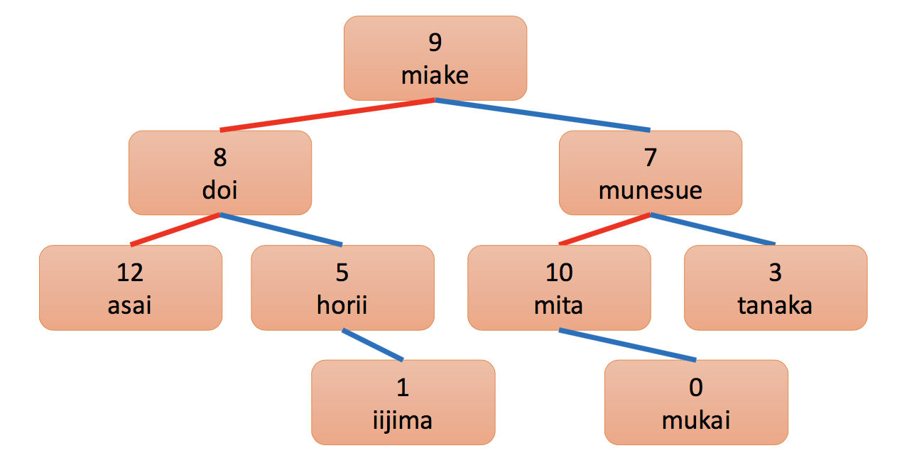

# 授業中練習問題13

ソースコード：[source.c](./source.c)

```
#include <stdio.h>
#include <stdlib.h>
#include <string.h>

#define MEMBER_NO 1
#define MEMBER_NAME 2

typedef struct {
    int no;
    char name[20];
} Member;

typedef struct __bnode {
    Member data;
    struct __bnode *left;
    struct __bnode *right;
} BinNode;

int MemberNoCmp(const Member *x, const Member *y) {
    return x->no < y->no ? -1 : x->no > y->no ? 1 : 0;
}

int MemberNameCmp(const Member *x, const Member *y) {
    return strcpy(x->name, y->name);
}

void PrintLnMember(const Member *x) {
    printf("%d %s\n", x->no, x->name);
}

Member ScanMember(const char *message, int sw) {
    Member temp;

    printf("Please input data to %s.\n", message);

    if (sw & MEMBER_NO) {
        printf("No: ");
        scanf("%d", &temp.no);
    }

    if (sw & MEMBER_NAME) {
        printf("Name: ");
        scanf("%s", temp.name);
    }

    return temp;
}

static BinNode *AllocBinNode(void) {
    return calloc(1, sizeof(BinNode));
}

static void SetBinNode(BinNode *n, const Member *x, const BinNode *left, const BinNode *right) {
    n->data = *x;
    n->left = (BinNode *) left;
    n->right = (BinNode *) right;
}

BinNode *Search(BinNode *p, const Member *x) {
    int cond;

    if (p == NULL)
        return NULL;
    else if ((cond = MemberNameCmp(x, &p->data)) == 0)
        return p;
    else if (cond < 0)
        return Search(p->left, x);
    else
        return Search(p->right, x);
}

BinNode *Add(BinNode *p, const Member *x) {
    int cond;

    if (p == NULL) {
        p = AllocBinNode();
        SetBinNode(p, x, NULL, NULL);
    } else if ((cond = MemberNameCmp(x, &p->data)) == 0)
        printf("[ERROR] %s already exists.\n", x->name);
    else if (cond < 0)
        p->left = Add(p->left, x);
    else
        p->right = Add(p->right, x);
    return p;
}

int Remove(BinNode **root, const Member *x) {
    BinNode *next, *temp;
    BinNode **left;
    BinNode **p = root;

    while (1) {
        int cond;
        if (*p == NULL) {
            printf("[ERROR] %s does not exists.\n", x->name);
            return -1;
        } else if ((cond = MemberNameCmp(x, &(*p)->data)) == 0)
            break;
        else if (cond < 0)
            p = &((*p)->left);
        else
            p = &((*p)->right);
    }
    if ((*p)->left == NULL)
        next = (*p)->right;
    else {
        left = &((*p)->left);
        while ((*left)->right != NULL)
            left = &(*left)->right;
        next = *left;
        *left = (*left)->left;
        next->left = (*p)->left;
        next->right = (*p)->right;
    }
    temp = *p;
    *p = next;
    free(temp);

    return 0;
}

void PrintTree(const BinNode *p) {
    if (p != NULL) {
        PrintTree(p->left);
        PrintLnMember(&p->data);
        PrintTree(p->right);
    }
}

void FreeTree(BinNode *p) {
    if (p != NULL) {
        FreeTree(p->left);
        FreeTree(p->right);
        free(p);
    }
}

typedef enum {
    TERMINATE, ADD, REMOVE, SEARCH, PRINT_ALL
} Menu;

Menu SelectMenu(void) {
    int i, ch;
    char *mstring[] = {"Insert", "Delete", "Search", "Print"};

    do {
        for (i = TERMINATE; i <PRINT_ALL; i++) {
            printf("(%2d) %-18.18s  ", i + 1, mstring[i]);
            if ((i % 3) == 2)
                putchar('\n');
        }
        printf("( 0) End : ");
        scanf("%d", &ch);
    } while (ch < TERMINATE || ch > PRINT_ALL);

    return (Menu) ch;
}

int main(void) {
    Menu menu;
    BinNode *root = NULL;

    do {
        Member x;
        BinNode *temp;

        switch  (menu = SelectMenu()) {
            case ADD:
                x = ScanMember("Insert", MEMBER_NO | MEMBER_NAME);
                root = Add(root, &x);
                break;
            case REMOVE:
                x = ScanMember("Delete", MEMBER_NAME);
                Remove(&root, &x);
                break;
            case SEARCH:
                x = ScanMember("Search", MEMBER_NAME);
                if ((temp = Search(root, &x)) != NULL)
                    PrintLnMember(&temp->data);
                break;
            case PRINT_ALL:
                puts("--- List ---");
                PrintTree(root);
                break;
        }
    } while (menu != TERMINATE);

    FreeTree(root);

    return 0;
}
```

**1)** このプログラムの動作直後に「Insert」を連続して *5* 回指示した結果、以下の図に示す 2 分探索木が得られた。このとき、以下の問に答える。


- (ア) 上図の 2 分探索木を得るためには、どのような順番でデータを入力する必要があるか、入力するデータの順番の例を2つ以上答える。
- (イ) この状態で、キーの値を "nomura" として「Search」を指示した。そのとき、どのような順序で探索が行われるか答える。

**2)** このプログラムの動作直後に「Insert」を連続して *9* 回指示した結果、以下の図に示す 2 分探索木が得られた。このとき、以下の問に答える。



- (ア) この状態の 2 分探索木に対し「帰りがけ順」でノードの表示を行うとすればどのように表示されるか。
- (イ) この状態の 2 分探索木に対し「通りがけ順」でノードの表示を行うとすればどのように表示されるか。

## 提出

```
1)
(ア)
例1: {12, "doi"}→{7, "abe"}→{20, "miki"}→{18, "komai"}→{100, "nomura"}
例2: {12, "doi"}→{20, "miki"}→{7, "abe"}→{18, "komai"}→{100, "nomura"}
例3: {12, "doi"}→{20, "miki"}→{7, "abe"}→{100, "nomura"}→{18, "komai"}
(イ)
{12, "doi"}→{20, "miki"}→{100, "nomura"}

2)
(ア)
12 asai
1 iijima
5 horii
8 doi
0 mukai
10 mita
3 tanaka
7 munesue
9 miake
(イ)
12 asai
8 doi
7 horii
1 iijima
9 miake
10 mita
0 mukai
7 munesue
3 tanaka
```